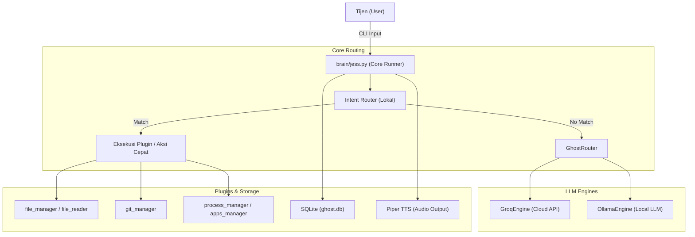

# Ghost Agent (Jess Core Fusion)

Ghost Agent is an interactive, local terminal-based AI assistant named Jess (Jarvis Core Fusion v0.5-fixed), designed to automate workflows, manage system files, check git repositories, and monitor processes directly from the command line.

## Features

* **Smart Intent Routing**: Automatically classifies user commands using `GhostRouter` to execute local utility functions or fall back to an LLM engine.


* **File & Directory Management**: Scan project directories, check file paths, and read file contents directly through built-in file plugins.


* **Git Integration**: Check git status and view recent commits inside specified repositories.


* **Process & Port Control**: Inspect active port owners or terminate process IDs dynamically.


* **Voice Feedback**: Integrated with Piper TTS (`id_ID-news_tts-medium.onnx`) for localized text-to-speech audio responses.


* **Persistent Memory**: SQLite-backed local memory tables (`jess_memory`) and activity logging via `db_manager`.


## Architecture & Flow



## Tech Stack

* **Language**: Python 3


* **Database**: SQLite3 (`ghost.db`)


* **Speech Synthesis**: Piper TTS engine


* **Architecture**: Modular plugin system (`file_manager`, `git_manager`, `process_manager`, `apps_manager`, `file_reader`)


## Installation & Setup

1. Clone the repository and navigate to the project directory:


```bash
git clone https://github.com/gsi-academy/ghost-agent.git
cd ghost-agent

```


2. Create and activate a Python virtual environment:


```bash
python3 -m venv venv
source venv/bin/activate

```


3. Install required dependencies:


```bash
pip install -r requirements.txt

```


4. Run the assistant core:


```bash
python3 brain/jess.py

```


## Project Structure

* `brain/jess.py`: Main core runner, session loop, and intent dispatcher for Jess.


* `core/`: Core identity and routing engines (`GhostRouter`, `identity_engine`).


* `plugins/`: System automation modules (`file_manager`, `git_manager`, `process_manager`, `apps_manager`, `file_reader`).


* `database/`: SQLite storage and activity logs (`ghost.db`).


* `piper/`: Local text-to-speech binaries and voice model files.


## Contributing & Plugin Interface

Want to add custom plugins or features? Follow these steps:

1. Fork the repository and create a new feature branch.
2. Build your custom plugin module inside the `plugins/` folder adhering to the modular structure.


### Plugin Template (`plugins/my_plugin.py`)

```python
def run_custom_feature(target_path):
    try:
        return f"Action executed successfully at {target_path}"
    except Exception as e:
        return f"Error: {str(e)}"

```

## Changelog

### [0.5-fixed]

* Integrated local Intent Router for rapid command execution.


* Modular plugin architecture support.


* Piper TTS local voice feedback integration.


## License

This project is licensed under the MIT License.
